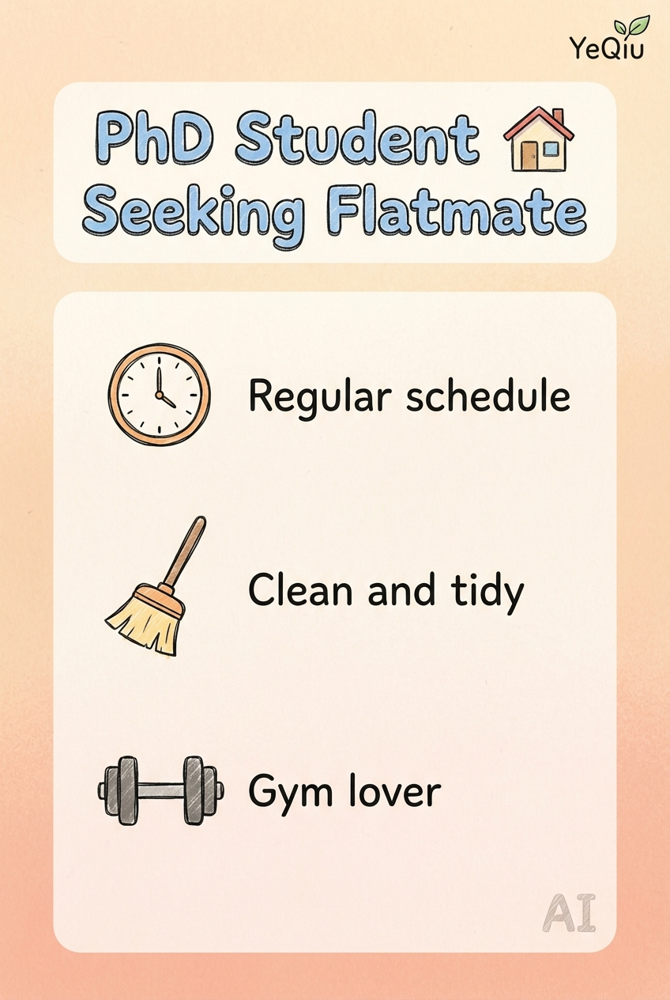
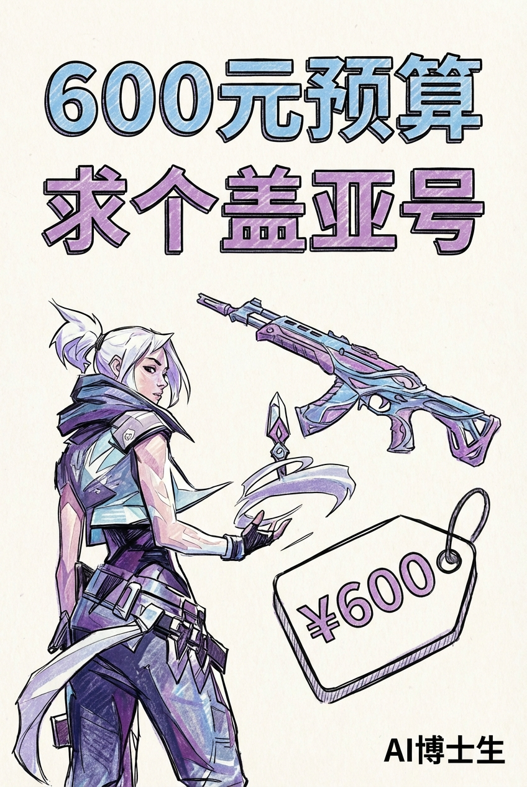

# 🔖 Tylo Rednote Skill — 小红书自动发布工作流

> 使用 Claude Code CLI + Gemini 图片生成 + xiaohongshu-mcp 实现**一句话自动生成并发布小红书笔记**。

[](https://www.docker.com/)
[](https://docs.anthropic.com/en/docs/claude-code)
[](https://ai.google.dev/)

---

## ✨ 功能概览

| 阶段 | 功能 | 工具 |
|------|------|------|
| Stage 1 | 文案生成 | Claude Code CLI（LLM 润色） |
| Stage 2 | 配图生成 | Gemini `gemini-3-pro-image-preview` |
| Stage 3 | 自动发布 | [xiaohongshu-mcp](https://github.com/xpzouying/xiaohongshu-mcp) |

### 工作流程


---

## 📸 效果展示

### Demo 1：港理工博士租房文案

> **标题**：🏠 港理工博士诚租厅长位（10 字 ≤ 15 字 ✅）

<table>
  <tr>
    <td></td>
    <td></td>
    <td></td>
  </tr>
  <tr>
    <td align="center">🏷️ 信息卡片</td>
    <td align="center">🌇 香港海景公寓</td>
    <td align="center">🛋️ 整洁室内</td>
  </tr>
</table>

<details>
<summary>📄 点击展开完整文案</summary>

**正文**：

救命！到处找房快疯了，来小红书碰碰运气吧！

本人香港理工大学PhD在读，稳定租到2026年9月，绝对不会中途跑路。先做个自我介绍帮大家参考：

🔬 日常基本泡在办公室搞科研，每天晚上10点后才回来，12点前必洗漱入睡。作息规律得像闹钟，完全不会打扰室友休息。

🧹 强迫症级别爱干净！每周至少全面打扫一次公共区域，做完饭立刻清理厨房，厨具归位、台面擦净。

📍 优先看海湾轩、海韵轩、南滨海岸的厅长位，采光通风好、设施齐全就行。对室友只有一个核心要求：不熬夜！

💰 预算合理可议，水电网分摊，中介勿扰！有合适房源的宝子快戳我私聊！

`#香港租房 #港理工租房 #海湾轩租房 #港漂租房 #博士租房`

</details>

---

### Demo 2：瓦洛兰特游戏收号文案

> **标题**：600r收瓦洛兰特亚服号（12 字 ≤ 15 字 ✅）

<table>
  <tr>
    <td></td>
    <td></td>
    <td></td>
  </tr>
  <tr>
    <td align="center">🎮 收号需求卡</td>
    <td align="center">⚔️ 游戏画面</td>
    <td align="center">🔒 交易流程</td>
  </tr>
</table>

---

## 🚀 快速开始

### 前提条件

- [Docker Desktop](https://www.docker.com/products/docker-desktop/)
- [Claude Code CLI](https://docs.anthropic.com/en/docs/claude-code) 已安装并登录
- Python ≥ 3.8 + `requests` / `Pillow`
- Gemini API Key（可通过 [Google AI Studio](https://aistudio.google.com/) 或第三方代理获取）

### 1. 克隆项目

```bash
git clone https://github.com/YOUR_USERNAME/tylo-rednote-skill.git
cd tylo-rednote-skill
```

### 2. 配置 Gemini API

编辑 `.claude/skills/tylo-rednote-skill/scripts/gemini_image_gen.py`，设置环境变量：

```bash
# Linux / macOS
export GEMINI_API_URL="https://generativelanguage.googleapis.com"
export GEMINI_API_KEY="your-api-key-here"

# Windows PowerShell
$env:GEMINI_API_URL = "https://generativelanguage.googleapis.com"
$env:GEMINI_API_KEY = "your-api-key-here"
```

或直接修改脚本中的 `DEFAULT_API_URL` 和 `DEFAULT_API_KEY`。

### 3. 启动 xiaohongshu-mcp

```bash
docker compose up -d
```

### 4. 注册 MCP 到 Claude CLI

```bash
claude mcp add --transport http xiaohongshu-mcp http://localhost:18060/mcp
```

### 5. 首次登录小红书

在 Claude CLI 中输入：

```
请调用 get_login_qrcode 获取登录二维码
```

然后用小红书 App 扫码登录。

### 6. 发布笔记

将你的文本素材放入 `.claude/skills/tylo-rednote-skill/assets/` 文件夹，然后在 Claude CLI 中输入：

```
请使用 tylo-rednote-skill 读取 assets/ 中的素材，生成小红书笔记并发布
```

Claude 会自动执行三个阶段：文案生成 → 图片生成 → 自动发布。

---

## 📁 项目结构

```
tylo-rednote-skill/
├── .claude/skills/tylo-rednote-skill/   ← Claude Skill 定义
│   ├── SKILL.md                         ← Skill 主文件（工作流定义）
│   ├── scripts/
│   │   ├── gemini_image_gen.py          ← Gemini 图片生成脚本
│   │   └── publish_to_xiaohongshu.py   ← 小红书发布脚本（MCP HTTP）
│   ├── assets/                          ← 用户放入的文本素材
│   ├── references/                      ← 参考图片（生图风格参考）
│   └── output/                          ← 运行输出（自动生成）
├── docker-compose.yml                   ← xiaohongshu-mcp 容器配置
├── images/                              ← Docker 映射的图片目录
├── data/                                ← MCP 登录数据（cookies）
├── docs/                                ← Demo 效果展示 & 文档
│   ├── demo-rental/                     ← 租房文案 Demo
│   ├── demo-valorant/                   ← 游戏收号 Demo
│   └── clash-network-troubleshooting.md ← 网络踩坑指南
├── .gitignore
└── README.md
```

---

## 🌐 网络配置（使用代理的用户必读）

### Clash 代理与小红书发布冲突

`creator.xiaohongshu.com`（发布平台）**仅限大陆 IP 访问**，而 Claude Code 需要代理才能连接 Anthropic API。两者直接冲突。

**错误做法**（不管用）：
- ❌ Clash 切 Global 模式 → 规则全部失效，无法分流
- ❌ Clash 切 Direct 模式 → Claude Code 断连

**正确方案：Clash Rule 模式 + DIRECT 规则**

**第一步**：Clash → 代理模式 → 选 **「规则 (Rule)」**

**第二步**：规则列表**最顶部**加入：
```yaml
rules:
  - DOMAIN-SUFFIX,xiaohongshu.com,DIRECT
  - DOMAIN-SUFFIX,xhslink.com,DIRECT
  # ... 其他原有规则
```

**第三步**：点击 Reload Config 重载配置

效果：小红书走大陆直连，Claude Code 继续走代理，两者同时正常。

> 📄 详细踩坑过程见 [docs/clash-network-troubleshooting.md](docs/clash-network-troubleshooting.md)

### Windows Git Bash 路径转换问题

在 Windows Git Bash 下调用发布脚本时，必须加 `MSYS_NO_PATHCONV=1`，否则 `/app/images/` 会被自动转换为 Windows 路径：

```bash
MSYS_NO_PATHCONV=1 PYTHONIOENCODING=utf-8 python \
  .claude/skills/tylo-rednote-skill/scripts/publish_to_xiaohongshu.py \
  --title "标题" \
  --content "正文" \
  --images /app/images/figure-1.png /app/images/figure-2.png
```

---

## ⚠️ 重要注意事项

### Docker 图片路径

xiaohongshu-mcp 运行在 Docker 容器中，**只能访问映射的目录**。发布时传给 `publish_content` 的图片路径必须是 **Docker 容器内路径**：

```
✅ 正确: /app/images/figure-1.png
❌ 错误: E:\Users\xxx\images\figure-1.png
❌ 错误: C:\Users\xxx\images\figure-1.png
```

发布前需要先将图片复制到项目根目录的 `images/` 文件夹。

### 标题字数限制

小红书标题限制 20 字以内。本 Skill 严格要求 **≤ 15 字**，生成后 AI 会逐字计数并自动重写。

### 安全提醒

- **不要**将 API Key 提交到 Git
- **不要**将 `data/cookies.json` 提交到 Git
- 本项目的 `.gitignore` 已排除上述敏感文件

---

## 🔗 相关项目

| 项目 | 说明 |
|------|------|
| [xiaohongshu-mcp](https://github.com/xpzouying/xiaohongshu-mcp) | 小红书 MCP 服务（本项目的发布引擎） |
| [Claude Code](https://docs.anthropic.com/en/docs/claude-code) | Claude CLI 工具 |
| [Google Gemini](https://ai.google.dev/) | 图片生成 API |

---

## 📝 License

MIT License

---

## 🤝 贡献

欢迎 PR 和 Issue！如果觉得有用，请给个 ⭐。
